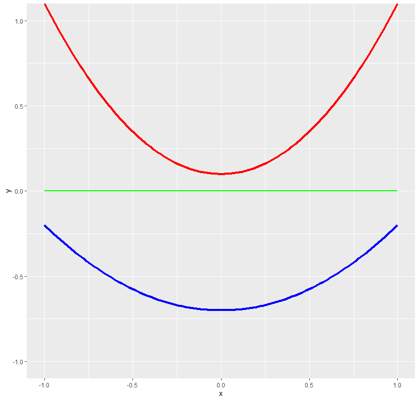
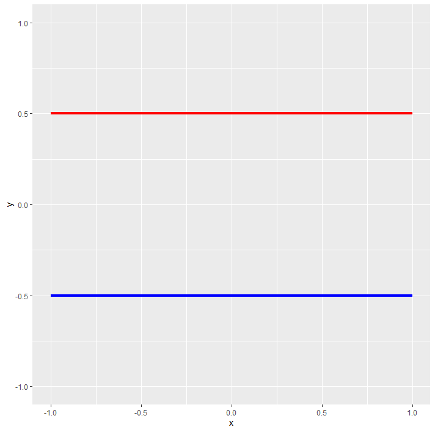
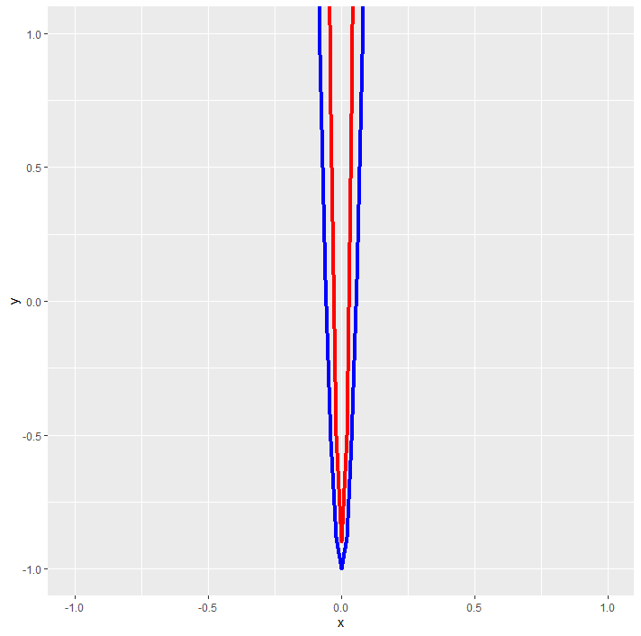

# 拓樸學在神經網絡的意義
文中引用大量[Colah](https://github.com/colah)的內容，這篇只是作為中文的整理推廣以及理解，[這裡](https://colah.github.io/)有更多他所寫的文章

神經網絡在高維度的空間中是很難被視覺化的，也因此很難被理解其中的涵義或他做了甚麼，接下來會討論二維空間以及三維空間的視覺化以及他們和拓樸學的關聯。
首先要先了解拓樸學是甚麼，根據[Wiki](https://zh.wikipedia.org/zh-tw/%E6%8B%93%E6%89%91%E5%AD%A6)的內容可以得知它的基本性質有許多，而這裡會討論的性質包含:

1. 拓撲不變性(Topological invariance)
2. 連通性(Connectivity)
3. 致密性(Density)
4. 同胚(Homeomorphism)
5. 連續映射(Continuous mapping / Continuous function)
6. 同倫(Homotopy)
7. 流形(manifold)

上述除了一般拓樸學的性質外，還包含**代數拓樸、微分拓樸以及幾何拓樸**，但是這個筆記並非以數學的角度切入，而是盡量以大家都看得懂的方式帶入。

## 範例
通常在二維的空間中如果我們要區分兩個類，會在他們中間加上一條線來區分，那這張圖要怎麼去理解?
從該圖可以看到兩個不同的欄位變成xy軸，而且軸都是介於-1到1之間，也就是激活函數tanh所回傳的結果，所以該圖為兩個neuron，我們的目標是將兩個兩個維度所繪製出來的圖找出一個可將其分類的線。

而在每次的轉換過程中，或是稱為**仿射變換（affine transformation）**，圖形都會因此扭曲變形，那我們期望的是他們在每次的轉換後都會越拉越開，例如以下(當然實際情況似乎不可能出現這樣的圖型，應該是很扭曲然後被拉開的)

但是我們可能會遇到另一種方式的扭曲，這顯然不會是區分兩個類別的最佳解，因為他們在被擠壓之後都快黏在一起了。

### 更複雜的案例
你看到了一樣兩個類別的圖形，但是一般的線性顯然是沒辦法去將它區分開來的，如果是對於最終找尋超平面的sigmoid或softmax來說，其中的neuron應該要是3個，因為在二維平面(2 neuron)不管怎麼扭曲或拉伸都不會將他們分開。但是為甚麼呢?當每個層都是**同胚**或是W為奇異的時候，那麼A永遠都會圍繞在B的外側。

所以說如果我們將二維提升到三維，或是說增加一個neuron，那麼這個layer就被映射到三維圖像中了，並且被一個hyperplane所分類。

## Tanh 的拓樸
從上述可得知在經過每個activation時會擠壓或被拉開，卻不會被剪斷或被破壞，這種性質就是拓樸的基礎，而這種轉換不影響拓樸的概念就是**同胚**，**Colah**在文章中提到了一個定理: 有N個欄位和N個輸出的層就稱為同胚，其中W為**非奇異**(行列式不為零、存在逆矩陣)。

由上述給定的條件可得知W是一個具有逆矩陣的**bijective linear function**，也就是一個向量可映射到另一個向量的同時確保線性關係，所以說在任何輸入乘上W後也都會是同胚的，同時所有轉換以及**連續映射**都是同胚。

